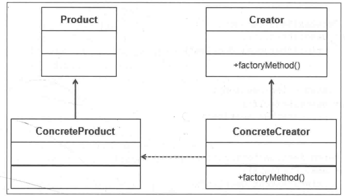
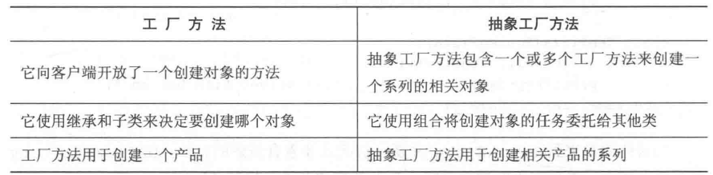
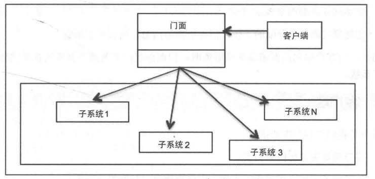
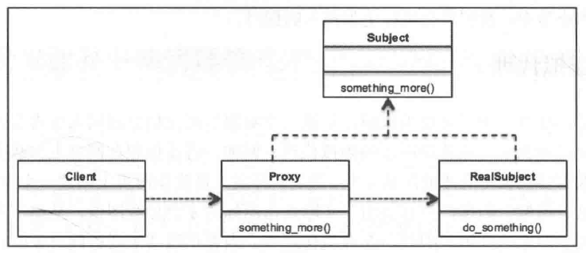
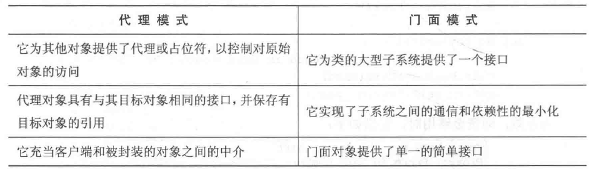
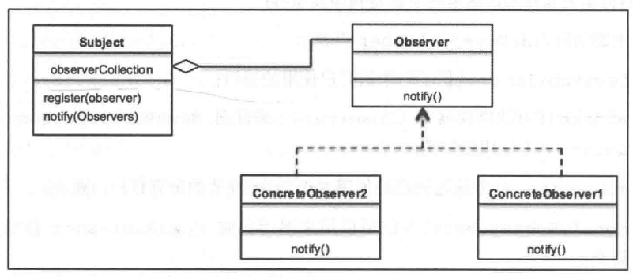

设计模式
---

##### 1. 设计模式遵循的七个原则

+ 单一职责原则
    + 对类来说，一个类应该只负责一项职责
    + 注意事项和细节
        + 降低类的复杂度，一个类只负责一项职责
        + 提高类的可读性，可维护性
        + 降低变量引起的风险
        + 通常情况下，我们应当遵守单一职责原则，只有逻辑足够简单，才可以在代码级违反单一职责原则
        + 只有类中函数数量足够少，可以在函数级别保持单一智职责原则

+ 接口隔离原则
+ 依赖倒转（倒置）原则
+ 里氏替换原则
+ 开闭原则
+ 迪米特法则
+ 组合/聚合复用原则

##### 2. 设计模式分三类

+ 创建型模式
+ 结构型模式
+ 行为型模式

##### 3. 各类型的性质

+ 创建型模式
    + 运行机制基于对象的创建方式
    + 将对象创建的细节隔离出来
    + 代码与所创建的对象的类型无关

+ 结构型模式
    + 致力于设计出能够通过组合获得更强大功能的对象和类的结构
    + 重点是简化结构并识别类和对象之间的关系
    + 主要关注类的继承和组合

+ 行为型模式
    + 关注对象的交互以及对象的响应性
    + 对象应该能够交互，同时仍然保持松散耦合

##### 4. 具体模式说明

+ 创建者模式
    + [单例模式](1.singleton.py)
      
        + 经典单例模式
        + 单例模式中的懒实例化
        + 模块级别的单例模式
        + 单状态单例模式，让实例共享相同的状态
            + `__init__` 实现
            + `__new__` 实现
            + 基于元类的单例模式
        + 单例实例应用
            + 数据库应用程序
            + 基础设施状态检测程序
        + 单例模式缺点
            + 单例模式具有全局访问权限，全局变量可能在某处已经被误改
            + 可能会对同一个对象创建多个引用
            + 所有依赖于全局变量的类都会由于一个类的改变而紧密耦合为全局数据，从而在无意中影响另一个类
        
    + [工厂模式](2.factory_simple_factory.py)
        
        + 简述
            + 工厂可以帮助开发人员创建不同类型的对象，而不是直接将对象实例化
        + 优点
            + 松耦合，对象的创建可以独立于类的实现
            + 简化了客户端的实现。无需了解创建对象的类，但是照样可以使用它来创建对象。只需要知道传递的接口、方法和参数，就能创建所需类型的对象
            + 可以很容易地在工厂中添加其它类来创建其它类型的对象，而无需修改客户端代码，最简单的情况下，客户端只需传递另一个参数即可
            + 可以重用现有对象。但是，如果客户端直接创建对象的话，总是创建一个新对象
        + 工厂模式的三个变种
            + 简单工厂模式
                + 允许接口创建对象，但不会暴露对象的创建逻辑
            + 工厂方法模式
                + 允许创建接口，但使用哪个类来创建对象，则是交由子类决定的
                + UML
                  
                    + 包含factoryMethod()方法的抽象类Creator
                    + factoryMethod()方法负责创建指定类型的对象
                    + ConcreteCreator类提供一个实现Creator抽象类的factoryMethod(),这种方法可以在运行时修改已创建的对象
                    + ConcreteCreator创建ConcreteProduct,并确保其创建的对象实现了Product类，同时为Product接口中的所有方法提供相应的实现
                    + 简言之，Creator接口的factoryMethod()方法和ConcreteCreator类共同决定了要创建Product的哪个子类
                    + 因此，工厂方法模式定义了一个接口来创建对象，但具体实例化哪个类则是由它的子类决定的
            + 抽象工厂模式
                + 提供一个接口来创建一系列相关对象，而无需指定/公开其具体类的接口
                + 该模式能够提供其它工厂的对象，在其内部创建其它对象
                + 不仅确保客户端与对象的创建相互隔离，同时还确保客户端能够使用创建的对象。但是，客户端只能通过借口访问对象
        
        + 工厂方法和抽象工厂的对比
        + 
        
    + 门面模式（外观模式，Facade Pattern）
        + 属于结构型设计模式
            + 结构型设计模式描述如何将对象和类组合成更大的结构
            + 是一种能够简化设计工作的模式，因为它能够找出更简单的方法来认识或表示实体之间的关系。
            + 在面向对象的世界中，实体值得是对象或类
            + 类模式可以通过继承来描述抽象，从而提供更有用的程序接口，而对象模式则描述了如何将对象联系起来从而组合成更大的对象。
            + 结构型模式是类和对象模式的综合体
        + 门面（facade）通常指建筑物的表面，当人们从建筑物外面经过时，可以欣赏其外部面貌，缺不了解建筑物结构的复杂性。
        + 它为子系统中的一组接口提供一个统一的接口，并定义一个高级接口来帮助客户端通过更加简单的方式使用子系统
        + 门面所解决的问题是：如何用单个接口对象来表示复杂的子系统。实际上，他并不是封装子系统，而是对底层子系统进行组合。
        + 它促进了实现与多个客户端的解耦
        + UML类图
            + 
            + 门面（facade）
                + 它是一个接口，它知道某个请求可以交由哪个子系统进行处理
                + 它使用组合将客户端的请求委派给相应的子系统对象
            + 在门面的世界里，系统就是执行以下操作的实体
                + 它实现子系统的功能，同事，系统由一个类表示。理想墙宽下，系统应该由一组负责不同任务的类来表示
                + 它处理门面对象分配的工作，但并不知道门面，而且不引用它
            + 客户端
                + 客户端是实例化门面的类
                + 为了让子系统完成相应的工作，客户端需要向门面提出请求
        
    + 代理模式
        + UML
            + 
                + 代理
                    + 它维护一个引用，允许代理（proxy）通过这个引用来访问实际对象。
                    + 它提供了一个与主题（Subject）相同的接口，以便代理可以替换真实的主题
                    + 代理还负责创建和删除真实主题（RealSubject）
                + 主题（subject）
                    + 它定义了RealSubject和Proxy的公共接口，大多数情况下是一个抽象基类
                    + 以RealSubject和Proxy的形式实现Subject，使用RealSubject的任何地方都可以使用代理Proxy
                + 真实主题
                    + 它定义代理（Proxy）所代表的真实对象
        + 代理模式是一个介于寻求方和提供方之间的中介系统。
            + 寻求方：发出请求的一方
            + 提供方：根据请求提供资源的一方
        + 代理就是封装实际服务对象的包装器或代理人。代理可以为其包装的对象提供附件功能，而无需更改对象的代码。
        + 代理模式的主要目的：为其它对象提供一个代理者或占位符，从而控制对实际对象的访问
        + 使用场景
            + 它能够以更加简单的方式表示一个复杂的系统。如涉及多个复杂计算或过程的系统应该提供一个简单的接口，让它充当客户端的代理
            + 提高了现有的袭击对象的安全性
            + 它为不同服务器上的远成永恒对象提供本地接口
            + 它为消耗大量额你村的对象提供了一个轻量级的句柄
        + 代理类型
            + 虚拟代理
                + 如果一个对象实例化后会占用大量内存的话，可以先利用占位符来表示，这就是所谓的虚拟代理
                + 比如网站上对大图片使用缩略图，点击缩略图后加载大图
                + 当用户端请求或访问对象时，才会创建实际对象
            + 远程代理
                + 它给位于远程服务器或不同地址空间上的实际对象提供了一个本地表示。
                    + 例如，我们要为应用建立一个监控系统，涉及多个、多类型服务器，就需要建立一个对象，
                      该对象能够用于监视应用程序运行的上下文中，同时还可以执行远程命令以获取实际的参数值。
            + 保护代理
                + 能够控制对敏感对象的访问
                    + 比如多服务的Web网站中的验证和授权服务器
            + 智能代理
                + 智能代理在访问对象时插入其它操作
                    + 比如检测对象是否被锁定，以确保没有其它对象可以更改它
            + 现实世界中的代理模式
                + [刷借记卡买东西](4.proxy_pattern_shopping.py)
        + 代理模式的优点
            + 通过缓存笨重的对象或频繁访问的对象来提高应用程序的性能
            + 提供对于真实主题的访问授权
            + 远程代理还便于与可用作网络连接和数据库连接的远程服务器进行交互，并可用于监视系统
        + 门面模式和代理模式的比较
            + 
        
    + 观察者模式（observer pattern）
        + 在观察者设计模式中，对象（主题）维护了一个依赖（观察者）列表，以便主题可以使用观察者定义的任何方法通知所有观察者它所发生的变化
        
        + 
        
        + 观察者模式的通知方式
            + 拉模型
        
                观察者扮演积极的角色
        
                + 每当发生变化时，主题都会向所有已注册的观察者进行广播
                + 出现变化时，观察者负责湖区相应的变化情况，或者从主题那里拉取数据
                + 拉模型的效率较低，因为它涉及到两个步骤
                    1. 主题通知观察者
                    2. 观察者从主题那里提取所需的数据
        
            + 推模型
        
                主题起主导作用
        
                + 变化由主题推送到观察者
                + 主题向观察者发送详细的信息（即使可能不需要）。当主题发送大量观察者用不到的数据时，会使相应时间过长
                + 由于只从主题发送所需的数据，所以能够提高性能
        
        + **优点**
        
            + 使得彼此交互的对象之间保持松耦合
            + 使得我们可以在无需对主题或观察者进行任何修改的情况下高效地发送数据到其它对象
            + 可以随时添加/删除观察者
        
        + **缺点**
        
            + 观察者必须由具体观察者实现，而这涉及继承。无法进行组合，因为观察者接口可以实例化
            + 如果实现不当的话，观察者可能会增加复杂性，并导致性能降低
            + 在软件应用程序中，通知有时可能是不可靠的，并导致竞争条件或不一致性
        
        + **松耦合设计原则**
        
            + 耦合
        
                + 指一个对象对于与其交互的其它对象的了解程度
        
            + 目的
        
                + 争取在彼此交互的对象之间实现松散耦合设计
        
            + 特性
        
                + 降低了在一个元素内发生的更改坑你对其它元素产生的意外影响的风险
                + 使得测试、维护和故障排查工作更加简单
                + 系统可以轻松地分解为可定义的元素
        
            + **观察者模式和松耦合**
        
                + 观察者模式提供了一种实现主题和观察者松耦合的对象设计模式
        
                    + 主题对观察者唯一的了解就是它实现了一个特定的接口。同时，他也不需要了解具体的观察者类
        
                    + 可以随时添加任意的新观察者
        
                    + 添加新的观察者时，根本不需要修改主题
        
                    + 观察者或主题没有绑定在一起，所以可以彼此独立使用
        
                    + 主题或观察者中的变化不会相互影响
        
                        
